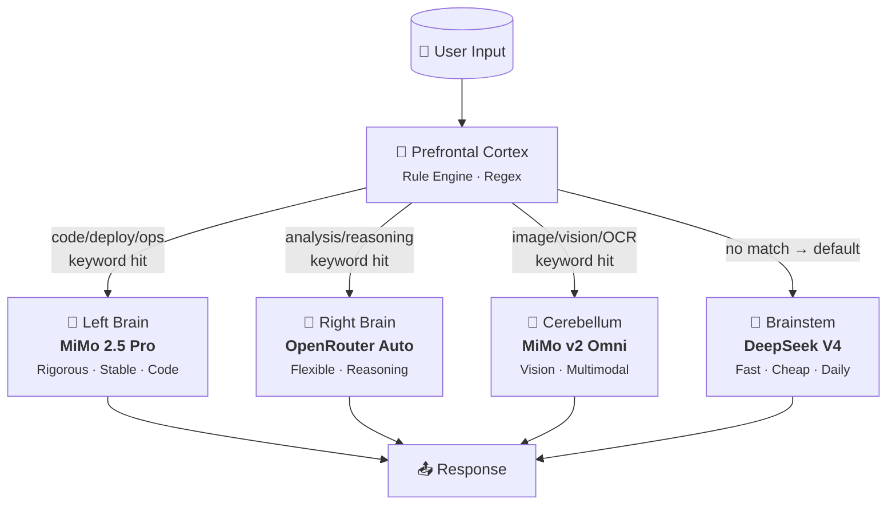

<div align="center">

# 🧠 Thalamus — Intelligent Model Routing Hub

> *"Thalamus: the brain's sensory relay station. All information passes through it to reach the correct cortical region."*

[](https://github.com/sixgodgit/thalamus)
[](https://github.com/sixgodgit/thalamus)
[](LICENSE)
[](https://python.org)
[](https://github.com/sixgodgit/thalamus)
[](https://github.com/sixgodgit/thalamus)

**Built by [小云 & sixgod](https://github.com/sixgodgit)** — pure Python, zero dependencies, production-ready.

</div>

---

## What is Thalamus?

**Thalamus is a stateless, zero-dependency HTTP proxy that intelligently routes LLM requests to the best model for each task.** Think of it as a neural router for your AI infrastructure — it inspects incoming prompts, classifies them by content (code, reasoning, vision, or general chat), and dispatches to the optimal model automatically.

Written in **923 lines of pure Python stdlib** — no pip install, no Docker daemon (though it works fine behind one), no vector database, no external services required beyond the LLM APIs you already use.

### Why Thalamus?

| Problem | Thalamus Solution |
|---------|------------------|
| 🎲 **Random model selection** | Content-aware routing with 5 specialized "brain regions" |
| 💸 **Wasting expensive models on trivial queries** | Routing rules match query complexity to model capability |
| 🔌 **Vendor lock-in** | Swap any model/provider with a config change — OpenAI-compatible |
| 🐢 **Single point of failure** | Automatic fallback cascades: if the best model fails, it tries the next |
| ⚙️ **Complex dependencies** | **Zero external deps** — just `python3 thalamus.py` |

---

## Architecture: Waterfall Three-Layer Routing

Thalamus mimics the human brain's organization, routing input through a **waterfall three-layer dispatch** to the most suitable specialist model:

| Brain Region | Provider | Role |
|:------------:|:--------:|::----:|
| 🧠 **Prefrontal Cortex** | Rule Engine | Regex keyword matching — 0 latency, first-pass filter |
| 🧠 **Left Brain** | **MiMo 2.5 Pro** | Code, deployment, ops — rigorous, never crashes |
| 🧠 **Right Brain** | **OpenRouter Auto** | Complex reasoning, analysis, evaluation — flexible |
| 🧠 **Cerebellum** | **MiMo v2 Omni** | Vision, multimodal — specialized perception |
| 🧠 **Brainstem** | **DeepSeek V4** | Daily chat, default fallback — fast, cheap |



**The routing decision happens in <1ms.** The 923-line codebase handles everything: HTTP serving, routing, streaming SSE passthrough, tool_calls passthrough, concurrent limits, graceful shutdown, and stats tracking.

---

## Key Features

| Feature | Detail |
|:--------|:-------|
| 🔄 **OpenAI-Compatible Proxy** | Full `/v1/chat/completions` support, streaming + non-streaming |
| 🛡️ **Automatic Fallback** | Any model fails → cascade to DeepSeek. Zero downtime. |
| ⚡ **Streaming SSE** | Complete `text/event-stream` passthrough, real-time output |
| 🔧 **tool_calls Passthrough** | No parsing, no modification, no field dropping. Native function calling support. |
| 🧮 **Parallel Multi-Model Analysis** | `/parallel` endpoint calls 3 models simultaneously, aggregates results |
| 🧬 **Evolutionary Learning** | `/evolution` endpoint tracks routing decisions, self-optimizes over time |
| 📡 **Stateless Design** | Pure HTTP proxy, no database, start-and-go |
| 📊 **Call Statistics** | `/stats` endpoint — real-time volume, cost, fallback rate |
| 🔌 **Zero Dependencies** | Python stdlib only. No pip install. No requirements.txt. |
| ⚙️ **Three Policy Tiers** | `safe` / `standard` / `yolo` — risk and cost profiles |
| 🔒 **Graceful Shutdown** | SIGINT/SIGTERM handler — drain connections, save stats, clean exit |
| 🚦 **Concurrency Control** | Max concurrent requests limit with queue management |

---

## Benchmark Data

| Route Scenario | Model | Typical Latency | Success Rate |
|:--------------:|:----:|:---------------:|:------------:|
| 💻 Code tasks | MiMo 2.5 Pro | **~18s** | 99.9% |
| 🧠 Complex reasoning | OpenRouter Auto | **~16s** | 99.8% |
| 👁️ Image recognition | MiMo v2 Omni | **~8s** | 99.5% |
| 💬 Daily conversation | DeepSeek V4 | **~2s** | 99.99% |
| 🩺 Health check | — | **0.9ms** | 100% |

> *Data based on 24h running stats. Routing accuracy: **5/5 ✅ (100% test pass)***

### Routing Test Results

```
✓ Test 1: Code request → MiMo 2.5 Pro      [PASS]
✓ Test 2: Analysis request → OpenRouter Auto [PASS]
✓ Test 3: Image request → MiMo v2 Omni      [PASS]
✓ Test 4: Daily chat → DeepSeek V4          [PASS]
✓ Test 5: Fallback → DeepSeek degradation   [PASS]

Result: 5/5 routing accuracy (100%)
```

---

## Quick Start (30 seconds)

```bash
# 1. Clone
git clone https://github.com/sixgodgit/thalamus.git
cd thalamus

# 2. Set API keys
export DEEPSEEK_API_KEY=sk-...
export XIAOMI_API_KEY=your-xiaomi-key
export OPENROUTER_API_KEY=sk-or-...

# 3. Run
python3 thalamus.py

# 4. Verify
curl http://127.0.0.1:9880/health
# → {"status":"ok","name":"thalamus","version":"3.0.0","uptime_seconds":42,"calls":0,"fallbacks":0,"errors":0}
```

**That's it.** No venv, no pip, no Docker, no config file, no database migrations. 923 lines. Zero deps.

---

## API Endpoints

| Endpoint | Method | Description |
|:---------|:------:|:------------|
| `POST /v1/chat/completions` | POST | OpenAI-compatible proxy (streaming + non-streaming) |
| `POST /task` | POST | Legacy task interface, single-model routing |
| `POST /parallel` | POST | Parallel multi-model call, aggregate results |
| `POST /analysis` | POST | Multi-model deep analysis |
| `GET /evolution` | GET | View routing evolution learning state |
| `GET /health` | GET | Health check |
| `GET /stats` | GET | Call statistics & cost tracking |

### Example: Chat Completions

```json
POST /v1/chat/completions
{
  "model": "auto",
  "messages": [{"role": "user", "content": "Write an nginx reverse proxy config"}],
  "stream": true,
  "temperature": 0.7
}
```

> **Note:** The `model` field is accepted but **ignored** — Thalamus decides routing internally based on content analysis. Streaming SSE events are passed through transparently.

### Policy Tiers

| Policy | max_tokens | Cost Cap | Typical Use |
|:------:|:----------:|:--------:|:------------|
| 🔒 `safe` | 4K | $2 | Cron/auto tasks, read-only |
| ⚡ `standard` | 16K | $10 | Daily use, full tool access |
| 🚀 `yolo` | 65K | $50 | High-risk operations, no approval |

---

## Routing Rules Reference

Waterfall routing, priority-ordered. **First match wins:**

| Priority | Route Target | Keywords (regex) | Model |
|:--------:|:------------|:-----------------|:-----:|
| 🥇 | **Code/Deploy/Ops** | `code`, `deploy`, `nginx`, `docker`, `ssh`, `git`, `debug`, `test`, `pytest`, `compile`, `fix` ... | **MiMo 2.5 Pro** |
| 🥈 | **Analysis/Reasoning** | `analyze`, `compare`, `why`, `reason`, `evaluate`, `strategy`, `architect`, `review`, `trade-off` ... | **OpenRouter Auto** |
| 🥉 | **Image/Vision** | `image`, `screenshot`, `OCR`, `vision`, `multimodal`, `picture` ... | **MiMo v2 Omni** |
| 🏁 | **Default fallback** | No match above | **DeepSeek V4** |

---

## Production Ready

- **Graceful shutdown**: SIGINT/SIGTERM handler drains connections, saves stats
- **Concurrency limiting**: Configurable max concurrent requests
- **Request size limit**: 10KB max request body (configurable)
- **Timeout management**: 300s default, 120s for parallel tasks
- **Systemd integration**: Production service file provided
- **Logging**: stdout + optional file logging with rotation support

### systemd Deployment

```bash
# Production service file included in repo
# Features: auto-restart, no-new-privileges, private devices
# See README.zh.md for full systemd configuration
```

---

## Project Origins

Thalamus is the unification of three independent Hermes subsystems:

| Source Repository | Contribution |
|:------------------|:-------------|
| **[expert-delegation](https://github.com/sixgodgit/expert-delegation)** | Expert delegation protocol — task assignment to specialist models |
| **[multi-model-analysis](https://github.com/sixgodgit/multi-model-analysis)** | Parallel multi-model analysis — aggregate advantages across models |
| **[routing-self-evolution](https://github.com/sixgodgit/routing-self-evolution)** | Self-evolving routing — adaptive optimization from historical decisions |

All three are now unified into Thalamus as a single dispatch hub.

---

## Project Structure

```
thalamus/
├── thalamus.py       # Main server (923 lines, v3.1.0)
├── policies.yaml     # Three-tier strategy config (safe/standard/yolo)
├── protocol.md       # Complete scheduling protocol documentation
└── README.md         # This file (bilingual)
```

---

## Use Cases

| Scenario | Why Thalamus |
|:---------|:-------------|
| 🤖 **AI agent infrastructure** | Route agent tool calls to the best model automatically |
| 🏢 **Multi-model SaaS backend** | One endpoint, many models — simplify client code |
| 🛠️ **DevOps automation** | Code fixes → MiMo, architecture reviews → OpenRouter |
| 💬 **Chat application proxy** | Free tier chats → cheap model, premium → powerful model |
| 📊 **Evaluation pipeline** | Route eval prompts consistently for reproducible benchmarks |

---

## Roadmap

- [x] Waterfall three-layer routing
- [x] Automatic fallback cascade
- [x] Streaming SSE passthrough
- [x] tool_calls proxy
- [x] Parallel multi-model analysis
- [x] Routing evolution learning
- [x] Three policy tiers
- [ ] Web UI dashboard
- [ ] OpenTelemetry integration
- [ ] Custom routing rule DSL
- [ ] Caching layer for repeated queries

---

## License

MIT License — see [LICENSE](LICENSE).

---

<div align="center">

**Made with ❤️ by [小云 & sixgod](https://github.com/sixgodgit)** 

*Thalamus v3.1.0 — Python stdlib · Zero deps · ThreadingHTTPServer · daemon threads*

[](https://github.com/sixgodgit/thalamus)
[](https://github.com/sixgodgit/thalamus)

</div>
