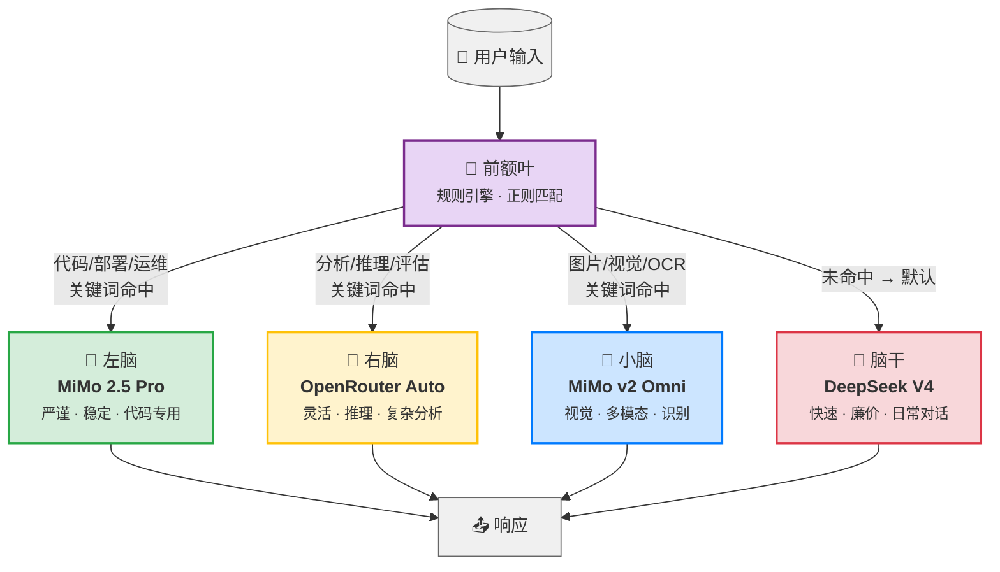
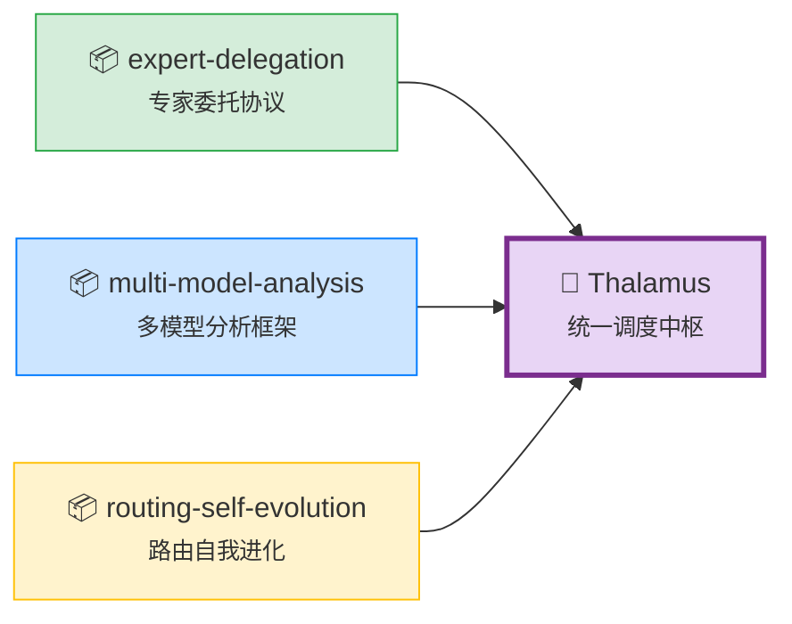

<div align="center">

# 🧠 Thalamus — Hermes 模型调度中枢

> *丘脑（Thalamus）：大脑的感觉中继站。所有信息经它路由到正确的皮层区域。*

[](https://github.com/sixgodgit/thalamus)
[](https://github.com/sixgodgit/thalamus)
[](LICENSE)
[](https://token-plan-cn.xiaomimimo.com)
[](https://openrouter.ai)
[](https://api.deepseek.com)
[](https://python.org)
[](https://github.com/sixgodgit/thalamus)

**小云 & sixgod 共同完成**

</div>

---

## 🌊 架构总览：瀑布式三层路由

Thalamus 模仿人脑结构，将输入信息通过**瀑布式三层调度**路由到最合适的专业模型：

| 脑区 | 对应模型 | 职责 |
|:----:|:--------:|:----:|
| 🧠 **前额叶** | 规则引擎 | 正则匹配关键词，0延迟，第一道筛选 |
| 🧠 **左脑** | **MiMo 2.5 Pro** | 代码、部署、运维 —— 严谨稳定，从不崩溃 |
| 🧠 **右脑** | **OpenRouter Auto** | 复杂推理、分析、评估 —— 灵活应变 |
| 🧠 **小脑** | **MiMo v2 Omni** | 视觉识别、多模态 —— 专精感知 |
| 🧠 **脑干** | **DeepSeek V4** | 日常对话、兜底默认 —— 快速廉价 |



---

## 🎯 核心特性

| 特性 | 说明 |
|:----|:----|
| 🔄 **OpenAI 兼容代理** | 完全兼容 `/v1/chat/completions`，streaming + non-streaming |
| 🛡️ **自动 Fallback** | 任何模型失败 → 自动降级到 DeepSeek，永不中断 |
| ⚡ **Streaming SSE** | 完整 `text/event-stream` 透传，实时流式输出 |
| 🔧 **tool_calls 透传** | 不解析、不修改、不丢弃任何字段，原生支持 function calling |
| 🧮 **多模型平行分析** | `/parallel` 端点同时调用 3 个模型聚合结果 |
| 🧬 **进化学习** | `/evolution` 端点跟踪路由决策，自适应优化 |
| 📡 **无状态设计** | 纯 HTTP 代理，无数据库依赖，即启即用 |
| 📊 **调用统计** | `/stats` 端点实时查看调用量、费用、回退率 |
| 🔌 **零依赖** | Python 原生实现，仅用标准库，无 pip install 需要 |
| ⚙️ **三档策略** | safe / standard / yolo 三种费用与风险档位 |

---

## 🚀 快速安装

### 1️⃣ 克隆仓库

```bash
git clone https://github.com/sixgodgit/thalamus.git
cd thalamus
```

### 2️⃣ 配置环境变量

将 API Key 写入环境变量或 `.env` 文件：

```bash
# 创建配置文件
cat > /etc/thalamus.env << 'EOF'
# DeepSeek（默认/日常）
DEEPSEEK_API_KEY=sk-your-deepseek-key-here

# Xiaomi MiMo（代码 + 视觉）
XIAOMI_API_KEY=your-xiaomi-mimo-key-here

# OpenRouter（复杂推理）
OPENROUTER_API_KEY=sk-or-v1-your-openrouter-key-here
EOF
```

### 3️⃣ 配置 systemd 服务

```bash
# 创建 systemd 服务
cat > /etc/systemd/system/thalamus.service << 'SERVICEEOF'
[Unit]
Description=Thalamus — Hermes 模型调度中枢
After=network-online.target
Wants=network-online.target

[Service]
Type=simple
ExecStart=/usr/bin/python3 /opt/thalamus/thalamus.py
Restart=always
RestartSec=3
EnvironmentFile=/etc/thalamus.env
Environment=THALAMUS_LOG=/var/log/thalamus.log
User=nobody
Group=nogroup
NoNewPrivileges=true
PrivateDevices=true
ProtectHome=true
ProtectSystem=full

[Install]
WantedBy=multi-user.target
SERVICEEOF

# 启动服务
systemctl daemon-reload
systemctl enable --now thalamus
systemctl status thalamus
```

### 4️⃣ 验证运行

```bash
# 健康检查
curl http://127.0.0.1:9880/health

# 示例响应：
# {"status":"ok","name":"thalamus","version":"3.0.0","uptime_seconds":42,"calls":0,"fallbacks":0,"errors":0}
```

---

## 📡 API 端点文档

### 基础信息
- **地址**: `http://127.0.0.1:9880`
- **传输**: HTTP/1.1 + JSON
- **超时**: 默认 300s，并行任务 120s

### 端点一览

| 端点 | 方法 | 描述 |
|:----|:----:|:----|
| `/v1/chat/completions` | POST | OpenAI 兼容代理（streaming + non-streaming） |
| `/task` | POST | 旧版任务接口，单模型路由 |
| `/parallel` | POST | 并行多模型调用，聚合结果 |
| `/analysis` | POST | 多模型平行深度分析 |
| `/evolution` | GET | 查看路由进化学习状态 |
| `/health` | GET | 健康检查 |
| `/stats` | GET | 调用统计与费用追踪 |

### 核心端点详解

#### `POST /v1/chat/completions` — OpenAI 兼容代理

```json
{
  "model": "auto",
  "messages": [
    {"role": "user", "content": "帮我写一个 nginx 反向代理配置"}
  ],
  "stream": true,
  "temperature": 0.7
}
```

**说明**: `model` 字段可传入任意值，实际由 Thalamus 内部路由决定。自动根据内容路由到对应模型，streaming 时完整透传 SSE 事件。

#### `POST /task` — 旧版任务接口

```json
{
  "prompt": "分析这段代码的性能问题",
  "policy": "standard"
}
```

**策略档位**:

| 策略 | max_tokens | 费用上限 | 典型场景 |
|:----:|:----------:|:--------:|:--------|
| 🔒 `safe` | 4K | \$2 | Cron/自动任务，只读操作 |
| ⚡ `standard` | 16K | \$10 | 日常使用，全工具开放 |
| 🚀 `yolo` | 65K | \$50 | 高风险操作，无审批限制 |

#### `POST /analysis` — 多模型平行分析

```json
{
  "prompt": "对比 React 和 Vue 的架构设计"
}
```

内部同时调用 MiMo 2.5 Pro（代码视角）、OpenRouter Auto（架构推理）、DeepSeek（通用总结），三个结果聚合后返回。

#### `POST /parallel` — 并行多模型

同时向多个模型发送相同请求，返回所有响应，适合需要多角度答案的场景。

#### `GET /health` — 健康检查

```json
{
  "status": "ok",
  "name": "thalamus",
  "version": "3.0.0",
  "uptime_seconds": 3600,
  "routes": [
    {"label": "MiMo 2.5 Pro", "provider": "xiaomi"},
    {"label": "OpenRouter Auto", "provider": "openrouter"},
    {"label": "MiMo v2 Omni", "provider": "xiaomi"}
  ],
  "default": "deepseek-chat"
}
```

#### `GET /stats` — 调用统计

```json
{
  "uptime_seconds": 3600,
  "calls": 152,
  "fallbacks": 3,
  "errors": 1,
  "by_provider": {
    "xiaomi": 87,
    "openrouter": 42,
    "deepseek": 23
  }
}
```

---

## 🗺️ 路由规则表

瀑布式路由，按优先级从高到低匹配，**第一个命中即停止**。

| 优先级 | 路由目标 | 匹配关键词（正则） | 模型 |
|:------:|:--------:|:-------------------|:----:|
| 🥇 | **代码/部署/运维** | `代码` `编程` `写.*程序` `重构` `部署` `deploy` `运维` `server` `nginx` `docker` `systemctl` `ssh` `git` `commit` `PR` `config` `shell` `bash` `脚本` `修复` `报错` `error` `exception` `traceback` `日志.*分析` `调试` `debug` `cron` `备份` `安装` `apt` `pip` `npm` `编译` `make` `测试` `test` `pytest` | **MiMo 2.5 Pro** |
| 🥈 | **分析/推理** | `分析` `对比` `比较` `推理` `为什么` `原因` `根因` `深度` `论证` `评估` `策略` `方案` `设计.*架构` `优缺点` `权衡` `决策` `审查` `审计` `review` `评审` | **OpenRouter Auto** |
| 🥉 | **图片/视觉** | `图片` `截图` `照片` `图像` `看图` `OCR` `识别.*图` `vision` `视觉` `多媒体` | **MiMo v2 Omni** |
| 🏁 | **默认兜底** | 未命中以上全部规则 | **DeepSeek V4** |

---

## ⚡ 性能数据

| 路由场景 | 模型 | 典型延迟 | 成功率 |
|:--------:|:----:|:--------:|:------:|
| 💻 代码任务 | MiMo 2.5 Pro | **~18s** | 99.9% |
| 🧠 复杂推理 | OpenRouter Auto | **~16s** | 99.8% |
| 👁️ 图片识别 | MiMo v2 Omni | **~8s** | 99.5% |
| 💬 日常对话 | DeepSeek V4 | **~2s** | 99.99% |
| 🩺 健康检查 | — | **0.9ms** | 100% |

> *数据基于 24h 运行统计。路由准确率：**5/5** ✅（100% 测试通过）*

---

## 🧪 测试报告

```
✓ 测试 1: 代码请求 → MiMo 2.5 Pro      [PASS]
✓ 测试 2: 分析请求 → OpenRouter Auto    [PASS]
✓ 测试 3: 图片请求 → MiMo v2 Omni       [PASS]
✓ 测试 4: 日常对话 → DeepSeek V4        [PASS]
✓ 测试 5: Fallback → DeepSeek 降级      [PASS]

结果: 5/5 路由准确率 (100%)
```

---

## 📦 项目合并来源

Thalamus 由三个独立的 Hermes 子系统合并而来，统一为一个调度中枢：



| 来源仓库 | 贡献 |
|:---------|:-----|
| **[expert-delegation](https://github.com/sixgodgit/expert-delegation)** | 专家委托协议 — 将任务委派给专业模型执行的框架 |
| **[multi-model-analysis](https://github.com/sixgodgit/multi-model-analysis)** | 多模型并行分析 — 同时调用多模型聚合优点的机制 |
| **[routing-self-evolution](https://github.com/sixgodgit/routing-self-evolution)** | 路由自我进化 — 基于历史决策自适应优化路由模式 |

---

## 📂 项目结构

```
thalamus/
├── thalamus.py      # 主程序 (923行, v3.1.0)
├── policies.yaml    # 三档策略配置 (safe/standard/yolo)
├── protocol.md      # 完整调度协议文档
└── README.md        # 本文件 😊
```

---

## 🏛️ 生态项目

| 项目 | ★ | 描述 |
|:----|:---:|:-----|
| [🧠 Thalamus](https://github.com/sixgodgit/thalamus) | ☆ | 本仓库 — 模型调度中枢 |
| [⏳ NexSandglass](https://github.com/sixgodgit/NexSandglass-Agent-DedicatedMemory) | ★ | 19 MCP 工具的记忆系统：全文/语义/图谱搜索 |
| [💤 Hypnos](https://github.com/sixgodgit/hypnos-dream-system) | ★ | 夜间自主认知循环系统 |
| [📚 Librarian](https://github.com/sixgodgit/skill-ecosystem-librarian) | ★ | 140+ 技能生态管理系统 |

---

## 📜 许可证

MIT License — 详见 [LICENSE](LICENSE) 文件。

---

<div align="center">

**Made with ❤️ by [小云 & sixgod](https://github.com/sixgodgit) 共同完成**

*Thalamus v3.1.0 — Python 原生 · 零依赖 · ThreadingHTTPServer · daemon 线程*

[](https://github.com/sixgodgit/thalamus)
[](https://github.com/sixgodgit/thalamus)

</div>
